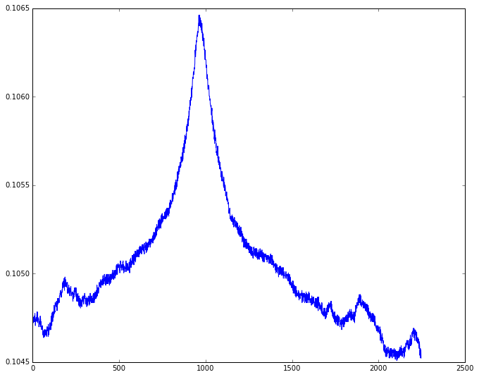
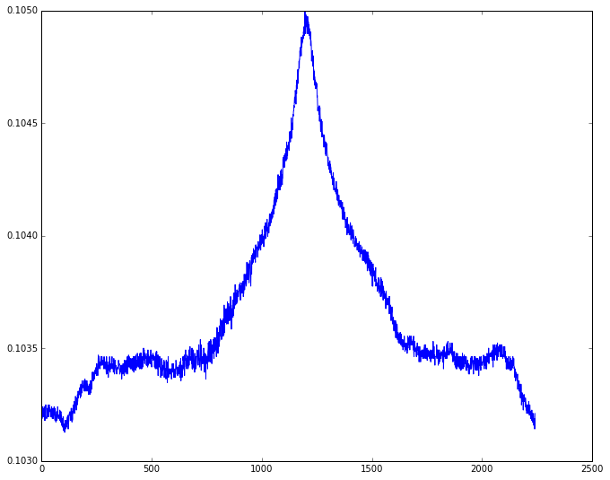

```python
import numpy as np
%matplotlib inline
from IPython.core.pylabtools import figsize
import numpy as np
from matplotlib import pyplot as plt
figsize(11, 9)

import scipy.stats as stats
from igor.binarywave import load as loadibw
from igor.packed import load as loadpxp
from igor.record.base import TextRecord
from igor.record.folder import FolderStartRecord, FolderEndRecord
from igor.record.variables import VariablesRecord
from igor.record.wave import WaveRecord
from igor import LOG
from igor.binarywave import Waves
import os.path

```


```python
w = Waves('/home/rui/Downloads/dat80g1x.ibw')
```


```python
fig, ax = plt.subplots(1,1)
ax.plot(w.x, w.y)
```


    [<matplotlib.lines.Line2D at 0x7f537b3c5ac8>]





```python
dat56g1x=Waves('/home/rui/Desktop/160918CVDgr_BN_10/dat56g1x.ibw')
```


```python
fig, ax = plt.subplots(1,1)
ax.plot(dat56g1x.x, dat56g1x.y)
```


    [<matplotlib.lines.Line2D at 0x7f537b305a90>]





```python

```
